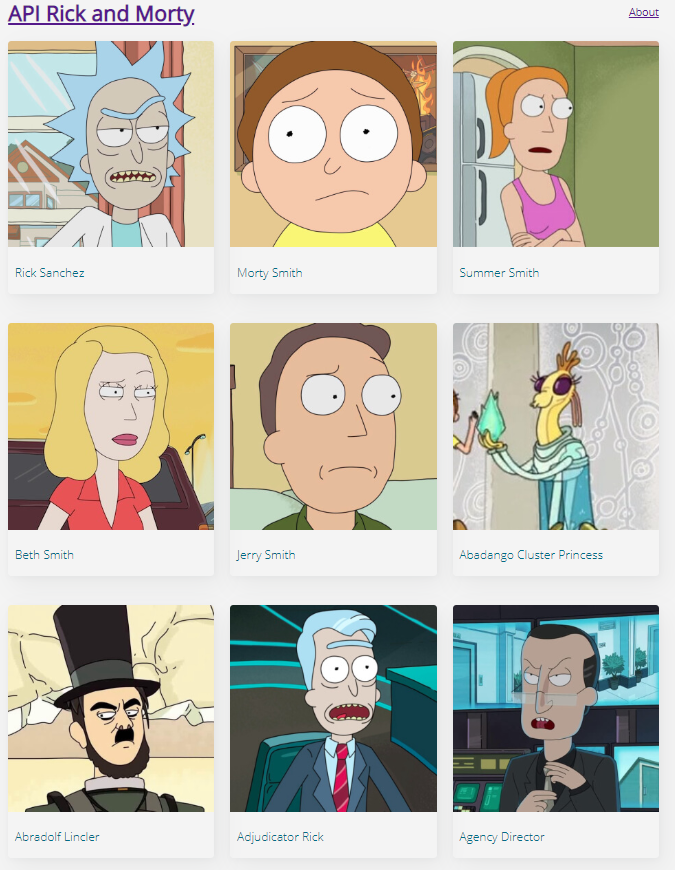
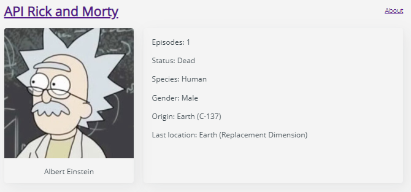

# Project Rick and Morty API :alien: :boy:

[Javascript](@tag/JavaScript) [Webpack](@tag/Webpack) [Travis](@tag/Travis) [Node](@tag/Node)

This project was created with [Vanilla JS](http://vanilla-js.com/)
The navigations was build with routers
Yes onli JS!!

## You can view the project in the next URL:

```markdown
https://dfloresdev.github.io/rick-and-morty/
```

## Look at me living

#### Index



#### Cards



## How to use the project?

#### Step 1

Run the next command in your terminal

```markdown
npm run install
```

#### Step 2

run the project

```markdown
npm run start
```

#### Build

If you want change the code, you must recompile

```markdown
npm run build
```

## Estructure project

```
/path
├─┬ dist
│ ├── index.html
│ ├── main.js
│ └── styles.css
├─┬ public
│ └── public.html
├─┬ src
│ ├─┬ pages
│ │ ├── Character.js
│ │ ├── Error404.js
│ │ └── Home.js
│ ├─┬ routes
│ │ └── index.js
│ ├─┬ styles
│ │ └── styles.css
│ ├─┬ template
│ │ └── Header.js
│ ├─┬ utils
│ │ ├── getData.js
│ │ ├── getHash.js
│ │ └── resolveRoutes.js
│ └── index.js
├── .gitignore
├── .travis.yml
├── package-lock.json
├── package.json
└── webpack.config.js
```

# Follow me [dflores.dev](https://dflores.dev/)

## Anywhere @dfloresdev
